# Admin User Management - Architecture Diagrams

This document contains architecture diagrams for the **Admin User Management** feature in the FoodFlow application.

---

## Table of Contents

1. [User Story Overview](#user-story-overview)
2. [Domain Model](#domain-model)
3. [Backend Architecture](#backend-architecture)
4. [System Sequence Diagrams](#system-sequence-diagrams)
5. [Database Schema](#database-schema)
6. [API Endpoints](#api-endpoints)
7. [Frontend Architecture](#frontend-architecture)
8. [Security & Access Control](#security--access-control)
9. [Testing Strategy](#testing-strategy)

---

## User Story Overview

**User Story:** As an admin, I want to view a list of all donors and receivers so that I can monitor platform participation, deactivate accounts when needed, and take administrative actions when issues arise.

### Story Points: 5 | Priority: 2 | Risk: Medium

### Acceptance Criteria

- ✅ Admin can view a table of all users, including donors and receivers
- ✅ For each user, the admin sees: Name, Role, Verification status, Account status, Number of donations/claims, Contact info, Flags/reports
- ✅ Admin can deactivate or reactivate a user account
- ✅ Admin can send automated alerts (warnings, safety notices, compliance reminders)
- ✅ Admin can filter users by: Role, Verification status, Account status, Flagged/high-risk
- ✅ Admin can search by name, email, or organization
- ✅ Deactivated users: Cannot log in, Cannot post or claim, Receive a suspension notification
- ✅ Admin can view a user's activity summary (claims, donations, disputes, feedback)

---

## Domain Model

### Domain Model Diagram - Admin User Management


### Key Entity Relationships

| Entity | Purpose | Key Fields |
|--------|---------|------------|
| **User** | Platform users (donors, receivers, admins) | id, email, role, accountStatus, adminNotes, deactivatedAt |
| **Organization** | Business/charity details linked to user | name, contactPerson, phone, verificationStatus |
| **AccountStatus** | User account state | ACTIVE, DEACTIVATED |
| **AdminUserResponse** | DTO for admin view with aggregated data | User info + donationCount + claimCount |

---

## Backend Architecture

### Layered Architecture Diagram

```mermaid
graph TB
    subgraph "Client Layer"
        Client["React Frontend<br/>AdminUsers Component"]
    end
    
    subgraph "Presentation Layer"
        AC["AdminController<br/>@RestController<br/>@RequestMapping('/api/admin')"]
    end
    
    subgraph "Security Layer"
        JWT["JwtAuthenticationFilter<br/>Validates JWT tokens"]
        RBAC["@PreAuthorize('hasAuthority(ADMIN)')<br/>Role-Based Access Control"]
    end
    
    subgraph "Business Logic Layer"
        AUS["AdminUserService<br/>- getAllUsers()<br/>- deactivateUser()<br/>- reactivateUser()<br/>- sendAlertToUser()"]
        WS["SimpMessagingTemplate<br/>WebSocket Notifications"]
    end
    
    subgraph "Data Access Layer"
        UR["UserRepository<br/>- findByRole()<br/>- findByAccountStatus()<br/>- findByEmailContaining()"]
        SPR["SurplusPostRepository<br/>- countByDonorId()"]
        CR["ClaimRepository<br/>- countByReceiverId()"]
    end
    
    subgraph "Domain Layer"
        ENT["Entities:<br/>User, Organization"]
        DTO["DTOs:<br/>AdminUserResponse<br/>DeactivateUserRequest<br/>SendAlertRequest"]
        ENUM["Enums:<br/>AccountStatus<br/>UserRole"]
    end
    
    subgraph "Database"
        DB[("PostgreSQL<br/>Tables: users, organizations")]
    end
    
    Client -->|HTTP + JWT| AC
    AC --> JWT
    JWT --> RBAC
    RBAC --> AUS
    
    AUS --> UR
    AUS --> SPR
    AUS --> CR
    AUS --> WS
    
    UR --> ENT
    SPR --> ENT
    CR --> ENT
    
    AUS ..> DTO
    ENT ..> ENUM
    
    UR --> DB
    
    style Client fill:#4A90E2,stroke:#2E5C8A,stroke-width:2px,color:#fff
    style AC fill:#F9A825,stroke:#C77800,stroke-width:2px
    style JWT fill:#EF5350,stroke:#C62828,stroke-width:2px,color:#fff
    style RBAC fill:#EF5350,stroke:#C62828,stroke-width:2px,color:#fff
    style AUS fill:#66BB6A,stroke:#388E3C,stroke-width:2px,color:#fff
    style WS fill:#66BB6A,stroke:#388E3C,stroke-width:2px,color:#fff
    style UR fill:#AB47BC,stroke:#7B1FA2,stroke-width:2px,color:#fff
    style SPR fill:#AB47BC,stroke:#7B1FA2,stroke-width:2px,color:#fff
    style CR fill:#AB47BC,stroke:#7B1FA2,stroke-width:2px,color:#fff
    style ENT fill:#FF9800,stroke:#E65100,stroke-width:2px
    style DTO fill:#FF9800,stroke:#E65100,stroke-width:2px
    style ENUM fill:#FF9800,stroke:#E65100,stroke-width:2px
    style DB fill:#42A5F5,stroke:#1976D2,stroke-width:2px,color:#fff
```

### Component Responsibilities

#### AdminController
- **Location:** `backend/src/main/java/com/example/foodflow/controller/AdminController.java`
- **Responsibilities:**
  - Handle HTTP requests for admin user management
  - Validate request parameters
  - Extract admin user from JWT for audit trail
  - Return appropriate HTTP responses

#### AdminUserService
- **Location:** `backend/src/main/java/com/example/foodflow/service/AdminUserService.java`
- **Responsibilities:**
  - Implement business logic for user management
  - Query and aggregate user data
  - Handle account status transitions
  - Send WebSocket alerts to users
  - Convert entities to DTOs

---

## System Sequence Diagrams

### Diagram 1: View All Users with Filters


### Diagram 2: Deactivate User Account


### Diagram 3: Reactivate User Account


### Diagram 4: Send Alert to User

```mermaid
sequenceDiagram
    actor A as Admin
    participant FE as React Frontend<br/>(AdminUsers.js)
    participant AC as AdminController<br/>POST /api/admin/users/{id}/send-alert
    participant AUS as AdminUserService
    participant UR as UserRepository
    participant WS as SimpMessagingTemplate<br/>(WebSocket)
    participant UQ as /user/{id}/queue/messages
    participant UFE as User's Frontend

    A->>FE: Click "Send Alert" on user row
    FE->>FE: Show alert modal
    
    A->>FE: Enter message: "Please update your contact information"
    A->>FE: Click "Send Alert"
    
    FE->>AC: POST /api/admin/users/123/send-alert<br/>Authorization: Bearer {JWT}<br/>{message: "Please update your contact information"}
    
    AC->>AUS: sendAlertToUser(123, "Please update...")
    
    AUS->>UR: findById(123)
    UR-->>AUS: User entity
    
    AUS->>AUS: Create alert notification object
    Note over AUS: {senderName: "🔔 Admin Alert",<br/>messageBody: "Please update...",<br/>timestamp: now}
    
    AUS->>WS: convertAndSendToUser(<br/>userId: "123",<br/>destination: "/queue/messages",<br/>payload: alertNotification)
    
    WS->>UQ: Route to user's queue
    UQ-->>UFE: WebSocket message received
    
    Note over UFE: User sees notification<br/>in real-time!
    
    AUS->>AUS: Append to adminNotes for audit trail
    Note over AUS: "[ALERT 2026-01-06]: Please update..."
    
    AUS->>UR: save(user)
    UR-->>AUS: Updated user
    
    AUS-->>AC: void (success)
    AC-->>FE: 200 OK + "Alert sent successfully"
    
    FE-->>A: Success: "Alert sent to user"
```



### Diagram 5: Deactivated User Blocked Flow


---

## Database Schema

### User Table Updates (Migration V20)

```sql
-- Migration: V20__Add_Account_Status_And_Admin_Notes_To_Users.sql

ALTER TABLE users 
ADD COLUMN IF NOT EXISTS account_status VARCHAR(20) DEFAULT 'ACTIVE';

ALTER TABLE users 
ADD COLUMN IF NOT EXISTS admin_notes TEXT;

ALTER TABLE users 
ADD COLUMN IF NOT EXISTS deactivated_at TIMESTAMP;

ALTER TABLE users 
ADD COLUMN IF NOT EXISTS deactivated_by BIGINT;

-- Add constraint for valid account status values
ALTER TABLE users 
ADD CONSTRAINT chk_account_status 
CHECK (account_status IN ('ACTIVE', 'DEACTIVATED'));

-- Add foreign key for deactivated_by (references admin user)
ALTER TABLE users 
ADD CONSTRAINT fk_deactivated_by 
FOREIGN KEY (deactivated_by) 
REFERENCES users(id);

-- Index for common query patterns
CREATE INDEX idx_users_account_status ON users(account_status);
CREATE INDEX idx_users_role_status ON users(role, account_status);
```

### Entity Relationship Diagram


---

## API Endpoints

### Admin User Management Endpoints

| Method | Endpoint | Description | Request Body | Response |
|--------|----------|-------------|--------------|----------|
| GET | `/api/admin/users` | List all users with filters | Query params | `Page<AdminUserResponse>` |
| GET | `/api/admin/users/{id}` | Get user details | - | `AdminUserResponse` |
| PUT | `/api/admin/users/{id}/deactivate` | Deactivate user | `DeactivateUserRequest` | `AdminUserResponse` |
| PUT | `/api/admin/users/{id}/reactivate` | Reactivate user | - | `AdminUserResponse` |
| POST | `/api/admin/users/{id}/send-alert` | Send alert to user | `SendAlertRequest` | `String` |
| GET | `/api/admin/users/{id}/activity` | Get user activity | - | `AdminUserResponse` |

### Query Parameters for GET /api/admin/users

| Parameter | Type | Required | Description |
|-----------|------|----------|-------------|
| `role` | String | No | Filter by role: DONOR, RECEIVER |
| `accountStatus` | String | No | Filter by status: ACTIVE, DEACTIVATED |
| `search` | String | No | Search by email (partial match) |
| `page` | Integer | No | Page number (default: 0) |
| `size` | Integer | No | Page size (default: 20) |

### Request/Response Examples

#### GET /api/admin/users?role=DONOR&accountStatus=ACTIVE&page=0

**Response:**
```json
{
  "content": [
    {
      "id": 1,
      "email": "restaurant@example.com",
      "role": "DONOR",
      "accountStatus": "ACTIVE",
      "organizationName": "Joe's Restaurant",
      "contactPerson": "Joe Smith",
      "phone": "+1-555-1234",
      "verificationStatus": "VERIFIED",
      "donationCount": 45,
      "claimCount": 0,
      "adminNotes": null,
      "createdAt": "2025-06-15T10:30:00",
      "deactivatedAt": null
    }
  ],
  "pageable": {
    "pageNumber": 0,
    "pageSize": 20
  },
  "totalElements": 1,
  "totalPages": 1
}
```

#### PUT /api/admin/users/123/deactivate

**Request:**
```json
{
  "adminNotes": "Repeated policy violations. Warning issued on 2025-12-01."
}
```

**Response:**
```json
{
  "id": 123,
  "email": "user@example.com",
  "role": "DONOR",
  "accountStatus": "DEACTIVATED",
  "organizationName": "Some Business",
  "adminNotes": "Repeated policy violations. Warning issued on 2025-12-01.",
  "deactivatedAt": "2026-01-06T21:15:00"
}
```

#### POST /api/admin/users/123/send-alert

**Request:**
```json
{
  "message": "Please update your organization's contact information within 7 days."
}
```

**Response:**
```
"Alert sent successfully"
```

---

## Frontend Architecture

### Component Structure


### AdminUsers.js Key Features

```javascript
// State Management
const [users, setUsers] = useState([]);
const [loading, setLoading] = useState(true);
const [filters, setFilters] = useState({
  role: '',
  accountStatus: '',
  search: ''
});
const [pagination, setPagination] = useState({
  page: 0,
  size: 20,
  totalPages: 0
});

// API Calls
const fetchUsers = async () => {
  const response = await api.get('/admin/users', { params: filters });
  setUsers(response.data.content);
};

const handleDeactivate = async (userId, adminNotes) => {
  await api.put(`/admin/users/${userId}/deactivate`, { adminNotes });
  fetchUsers(); // Refresh list
};

const handleReactivate = async (userId) => {
  await api.put(`/admin/users/${userId}/reactivate`);
  fetchUsers();
};

const handleSendAlert = async (userId, message) => {
  await api.post(`/admin/users/${userId}/send-alert`, { message });
};
```

---

## Security & Access Control

### Authentication Flow


### Security Implementation

```java
// AdminController.java
@RestController
@RequestMapping("/api/admin")
@PreAuthorize("hasAuthority('ADMIN')")  // Requires ADMIN role
public class AdminController {
    // All endpoints require ADMIN authority
}

// SecurityConfig.java
http.authorizeHttpRequests(auth -> auth
    .requestMatchers("/api/admin/**").hasAuthority("ADMIN")
    .requestMatchers("/api/auth/**").permitAll()
    .anyRequest().authenticated()
);
```

### Deactivated User Restrictions

When a user is deactivated, they are blocked from:

1. **Login** - AuthService checks `accountStatus` before generating JWT
2. **Creating Posts** - SurplusController validates user status
3. **Making Claims** - ClaimService validates user status
4. **Sending Messages** - MessageService validates user status

```java
// In AuthService.login()
if (user.getAccountStatus() == AccountStatus.DEACTIVATED) {
    throw new AccountDeactivatedException("Your account has been deactivated");
}
```

---

## Testing Strategy

### Unit Tests

```java
// AdminUserServiceTest.java
@Test
void testDeactivateUser_Success() {
    // Given
    User user = new User();
    user.setId(1L);
    user.setRole(UserRole.DONOR);
    user.setAccountStatus(AccountStatus.ACTIVE);
    
    when(userRepository.findById(1L)).thenReturn(Optional.of(user));
    when(userRepository.save(any(User.class))).thenReturn(user);
    
    // When
    AdminUserResponse result = adminUserService.deactivateUser(1L, "Test notes", 99L);
    
    // Then
    assertEquals("DEACTIVATED", result.getAccountStatus());
    assertEquals("Test notes", result.getAdminNotes());
    verify(userRepository).save(any(User.class));
}

@Test
void testDeactivateUser_CannotDeactivateAdmin() {
    // Given
    User admin = new User();
    admin.setRole(UserRole.ADMIN);
    
    when(userRepository.findById(1L)).thenReturn(Optional.of(admin));
    
    // When & Then
    assertThrows(RuntimeException.class, () ->
        adminUserService.deactivateUser(1L, "notes", 99L)
    );
}
```

### Controller Tests

```java
// AdminControllerTest.java
@Test
@WithMockUser(authorities = "ADMIN")
void testGetAllUsers_AsAdmin_ReturnsOk() throws Exception {
    mockMvc.perform(get("/api/admin/users")
            .param("role", "DONOR")
            .param("accountStatus", "ACTIVE"))
        .andExpect(status().isOk())
        .andExpect(jsonPath("$.content").isArray());
}

@Test
@WithMockUser(authorities = "DONOR")
void testGetAllUsers_AsDonor_ReturnsForbidden() throws Exception {
    mockMvc.perform(get("/api/admin/users"))
        .andExpect(status().isForbidden());
}
```

### Integration Tests

```java
// AdminIntegrationTest.java
@Test
void testFullDeactivationFlow() {
    // 1. Create a donor user
    User donor = createTestDonor();
    
    // 2. Deactivate via admin endpoint
    mockMvc.perform(put("/api/admin/users/" + donor.getId() + "/deactivate")
            .contentType(MediaType.APPLICATION_JSON)
            .content("{\"adminNotes\": \"Test deactivation\"}")
            .header("Authorization", "Bearer " + adminToken))
        .andExpect(status().isOk())
        .andExpect(jsonPath("$.accountStatus").value("DEACTIVATED"));
    
    // 3. Verify user cannot login
    mockMvc.perform(post("/api/auth/login")
            .contentType(MediaType.APPLICATION_JSON)
            .content("{\"email\": \"" + donor.getEmail() + "\", \"password\": \"password\"}"))
        .andExpect(status().isForbidden());
}
```

---

## Key Design Decisions

### 1. Soft Delete vs Hard Delete
- **Decision:** Soft delete (status change)
- **Rationale:** Preserves audit trail, allows reactivation, maintains data integrity

### 2. WebSocket for Alerts
- **Decision:** Use existing messaging WebSocket infrastructure
- **Rationale:** Real-time delivery, no new infrastructure needed, consistent UX

### 3. Admin Notes Append-Only
- **Decision:** Append new notes rather than overwrite
- **Rationale:** Maintains complete history of admin actions

### 4. Pagination for User List
- **Decision:** Server-side pagination (20 users per page)
- **Rationale:** Performance with large user bases, reduces memory usage

### 5. Role-Based Security at Controller Level
- **Decision:** `@PreAuthorize` annotation on entire controller
- **Rationale:** Single point of security, consistent access control

---

*Last Updated: January 6, 2026*  
*FoodFlow Capstone Project - SOEN 490*
